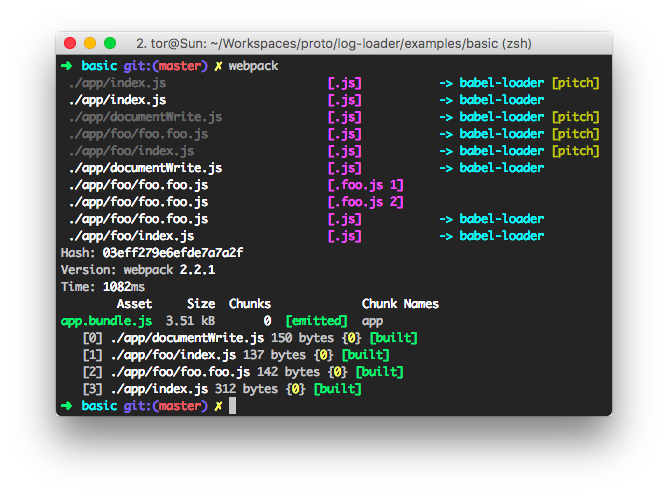

# log-loader




<h2 align="center">Install</h2>

```bash
npm install --save-dev log-loader
```

<h2 align="center">Usage</h2>


### Via webpack config (recommended)

**webpack.config.js**
```js
module.exports = {
  module: {
    rules: [
      {
        test: /\.css$/,
        use: [ 
          'style-loader',
          'log-loader?id=after-css&showSource=true',
          'css-loader',
          'log-loader?id=before-css&showSource=true',
        ]
      }
    ]
  }
}
```

<h2 align="center">Options</h2>

Options may passed via query params too.
 
### Defaults

```js
{
  loader: 'log-loader',
  options: {
    id: '',
    showIndex: false,
    showSource: false,
    showPitch: false,
    showNextLoader: false,
    showPrevLoader: false,
    
    // string sizes
    pad: {
      id: 15,
      index: 4,
      loader: 15,
      file: 35
    },
    
    // only option params, this = loader context
    callback: function (source) { return source; },
    callbackPitch: function (remainingRequest, precedingRequest, data) {}
  }
}
```
